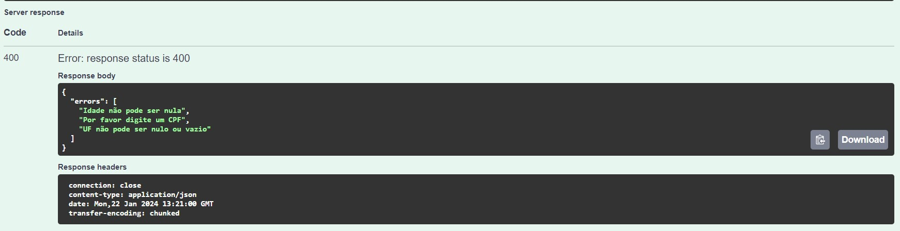
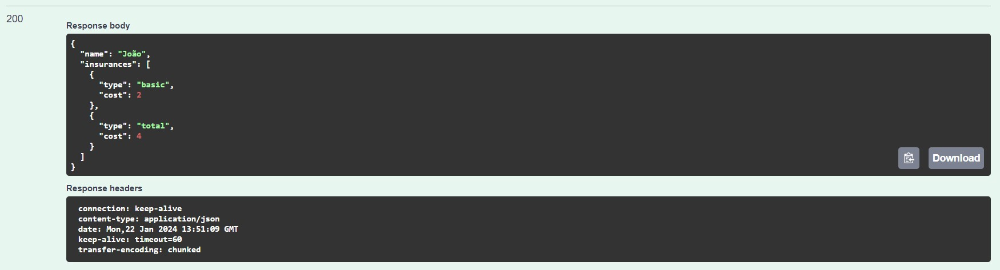
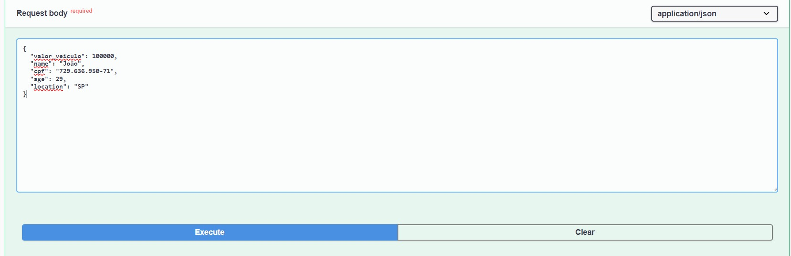

## Qual é a solução utilizada ?

Linguagem: Java/Spring Boot

Decidi fazer algo mais simples, utilizando Postgresql e a versão 3.x do Spring Boot.

Criei uma classe chamada TypeInsuranceUtil no qual tem toda a regra de implementação da logica.

Pensei em utilizar o design pattern strategy para ela, porém como é uma regra só não foi necessario.

Fiz as funções principais com Predicate é uma função excelente, que é uma alternativa para ifs e elses


<br/>
A logica principal que utilizei é definir quais parametros são de quais items exemplo:
3 Validações principais sendo elas

Veículo <= 70.000 = true then return List.of("basic") && if Clientes com menos de 30 anos que residem em SP = true then List.of("basic", "partial")

Então faço a validação principal é Veículo <= 70.000 e depois caso a proxima validação seja true então adicionamos no escopo o "partial"

A mesma coisa acontece nos outros

Veículo > 70.000 e < 100.000 = true then return List.of("basic") && if Clientes que residem em SP == true return List.of("basic", "partial")

Agora caso a validação seja igual a de baixo
Veículo => 100.000  == true then return List.of("basic", "partial") && if Clientes com menos de 30 anos == true return List.of("basic", "partial", "total")

Conseguimos fazer as validações principais e suas subvalidações.


<br/>

Agora vamos fazer os testes, com o projeto em sua maquina já tanto rodando no docker-compose.yml quando a imagem no docker hub

Vamos iniciar aplicação e ir no swagger para ter uma maior facilidade na hora de fazer as requisições

Acessando: http://localhost:8080/swagger-ui/index.html


<br/>

Temos duas requisições, a principal que vamos focar é a requisição POST /api/v1/customers


<br/>

Temos o objeto que vamos mandar e sempre atento a algumas validações no corpo da requisição
- O CPF é valido
- A idade é maior que 18 anos
- Todos os campos são obrigatorios.

Caso contrario setamos na Controller handler erros customizados então caso não coloque nenhum parametro obrigatorio vai estourar alguns erros como abaixo.


<br/>

<br/>

Agora vamos para os testes
Eu optei de salvar todos os dados do customer na hora que ele envia a requisição e não somente o nome e o seguro, pois precisamos desses dados para consultar ele novamente

## Primeiro Teste 

# Veículo <= 70.000 == true somente

*input*
```json
{
  "customer": {
    "name": "João",
    "cpf": "729.636.950-71",
    "age": 29,
    "location": "BH",
    "valor_veiculo": 70000
  }
}
```


<br/>

*output*


## Segundo teste
# Veículo <= 70.000 == true && Clientes com menos de 30 anos que residem em SP = true

*input*
```json
{
  "customer": {
    "name": "João",
    "cpf": "729.636.950-71",
    "age": 29,
    "location": "SP",
    "valor_veiculo": 70000
  }
}
```


<br/>


*output*


## Terceiro teste
# Veículo > 70.000 e < 100.000 somente

*input*
```json
{
  "customer": {
    "name": "João",
    "cpf": "729.636.950-71",
    "age": 29,
    "location": "BH",
    "valor_veiculo": 80000
  }
}
```


<br/>

*output*


## Quarto teste
# Veículo > 70.000 e < 100.000 && Clientes que residem em SP

*input*
```json
{
  "customer": {
    "name": "João",
    "cpf": "729.636.950-71",
    "age": 29,
    "location": "SP",
    "valor_veiculo": 80000
  }
}
```


<br/>

*output*


## Quinto teste
# Veículo => 100.000 somente

*input*
```json
{
  "customer": {
    "name": "João",
    "cpf": "729.636.950-71",
    "age": 30,
    "location": "SP",
    "valor_veiculo": 100000
  }
}
```


<br/>

*output*



## E por ultimo Sexto teste
# Veículo => 100.000 && Clientes com menos de 30 anos

*input*
```json
{
  "customer": {
    "name": "João",
    "cpf": "729.636.950-71",
    "age": 29,
    "location": "SP",
    "valor_veiculo": 100000
  }
}
```


<br/>

*output*


Esse foi o teste, e a solução utilizada.